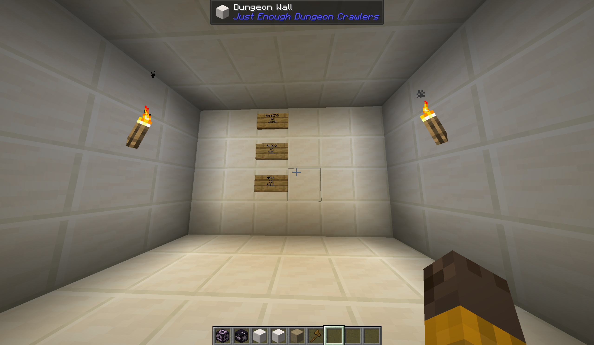

# Just Enough Dungeon Crawlers

## Setup

For setup instructions, please see the [Fabric Documentation page](https://docs.fabricmc.net/develop/getting-started/creating-a-project#setting-up) related to the IDE that you are using.

## License

This template is available under the CC0 license. Feel free to learn from it and incorporate it in your own projects.

# DungeonCrawler #

### INFO ###
*  We build a DungeonCrawler like Mod for Minecraft. So its somehow a endless cycle in the sense, that you are limited to just 2 rooms each dimension and then you only . have 2 options or longterm basicly just 1: take the key and unlock the next dimension trough opening the ascender, but be ready there is another dungeon and another one and another, another and another, nothing else. 
Get comftorable with never seeing anything else again, except the **DUNGEON**, because now your trapped! **In an endless cycle**.
* Or is there an escape?
Well actually no...right? Maybe there is one solution, but is it really worth it?
Giving up so so so much will hurt and thats not the only "thing", that will get hurt*...
The one room is a equipment room, where you can weaponize yourself (you first have to unlock it ofc) and the other room is basicly just the dungeon, where you have to fight different mops (hopefully with added Levels) and with the ascender block through which you can enter the next dimension (also has to be unlocked).
!()

!()
!()
+many more Designs (other ascender blocks + keys fitting for the dungeon theme) couldnt be 
implemented in time...

### tech stack ###
- Minecraft
-->Mod: DimLib
- LibreSprite
- Blockbench
- VS Code
-->Java,Fabric

### Installation ###
To install the mod you just need to put the .jar file in your YOUR_MINECRAFT_INSTANCE/mods/ folder with the Dependency Mods on a Fabric installation.
### AI usage ###
AI was usage was mostly limited to debugging and explaining some concepts/finding documentation since up-to-date documentation for mod development is fairly limited.
